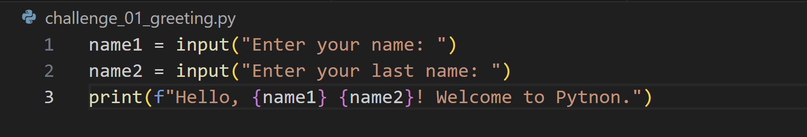
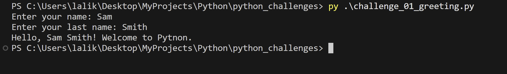
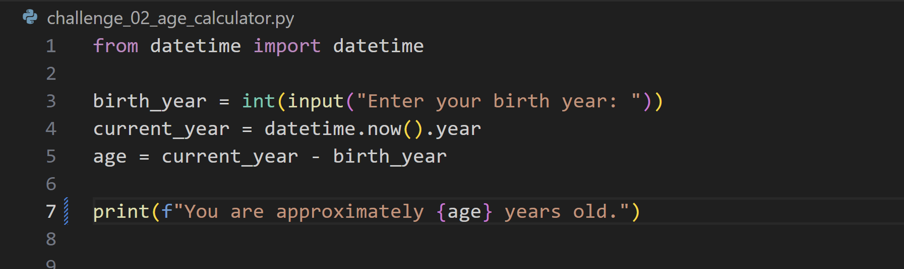
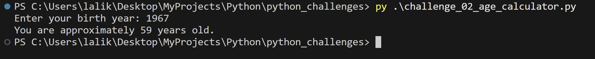
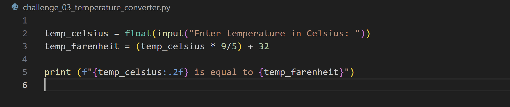
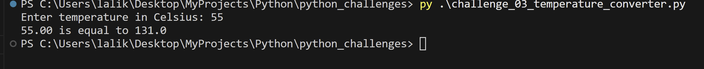
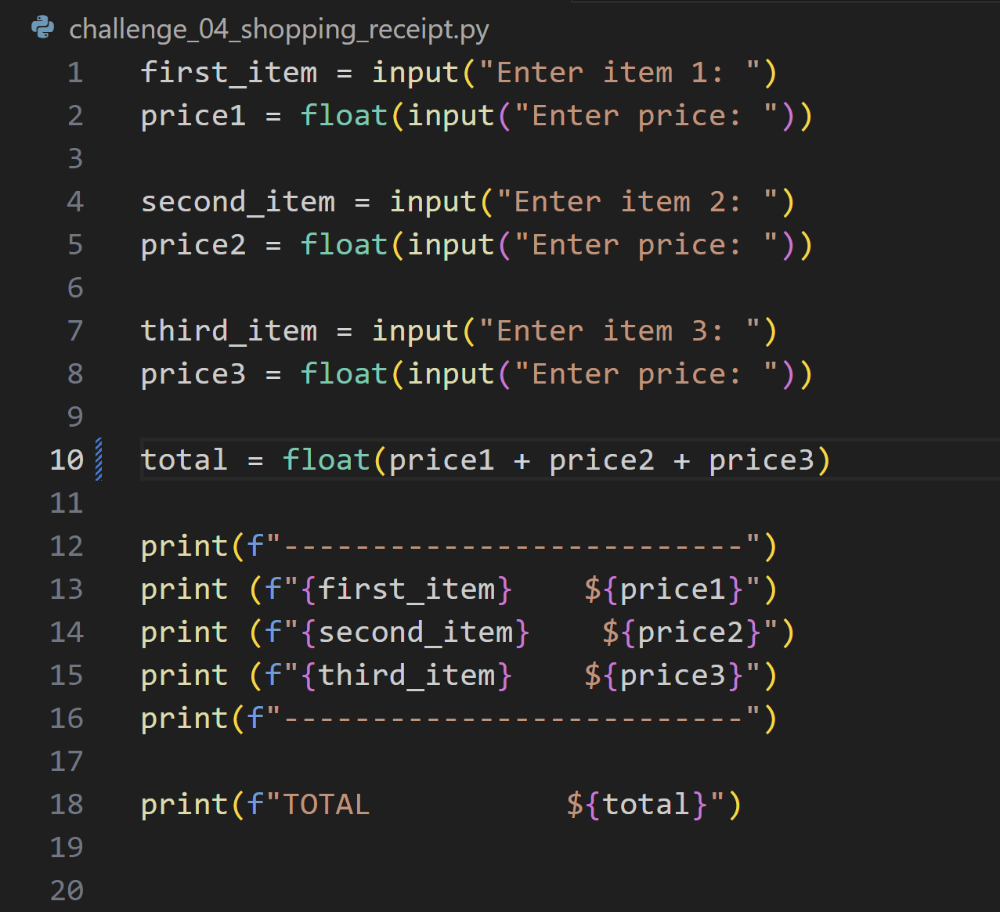
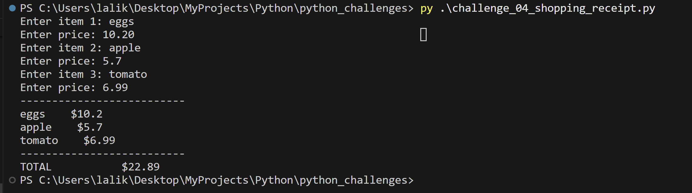
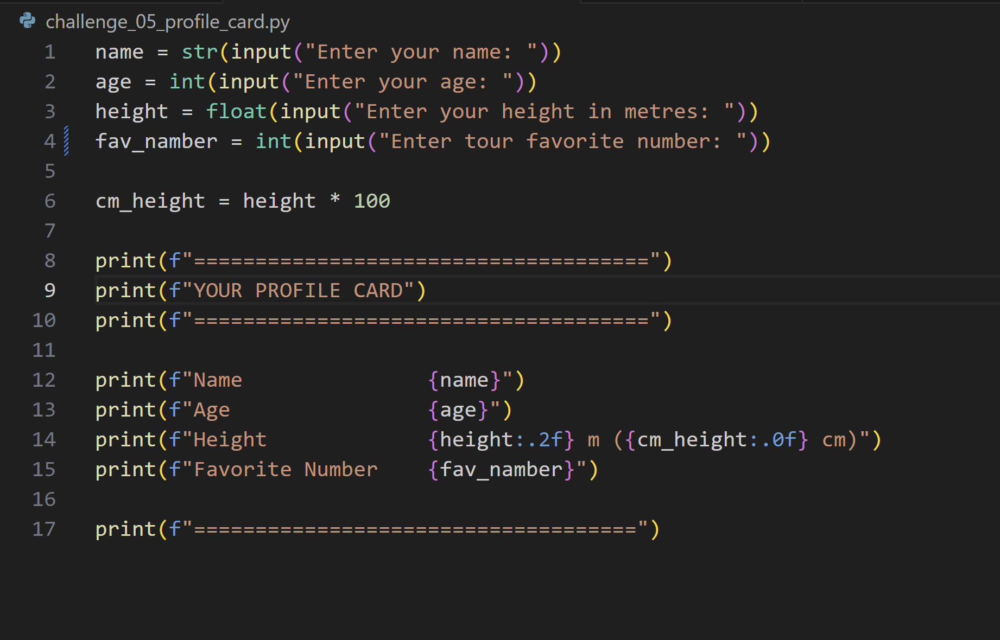
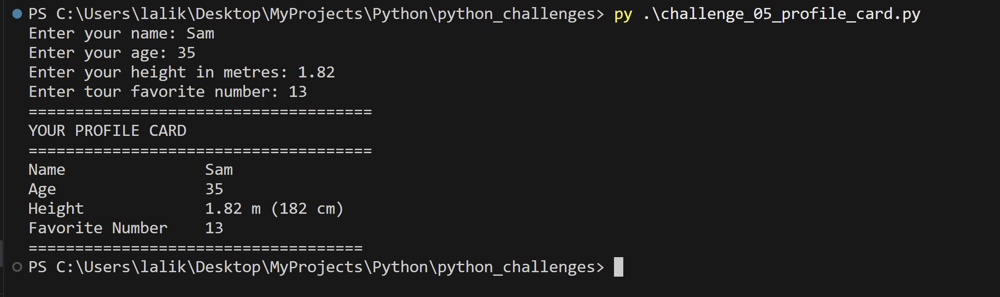

# Python Beginner Challenges

## 🔁 Challenge 1 — Personalised Greeting
#### **📚 Concepts**: input(), string formatting with f-strings.

#### **🎯 Goal**: Ask the user for their first and last name, then print a formatted greeting message.

#### **Result**

## 🔁 Challenge 2 — Age Calculator
#### **📚 Concepts**: input(), data casting with int(), arithmetic, string formatting.

#### **🎯 Goal**: Ask the user for their birth year and calculate their current age. 

#### **Result**

## 🔁 Challenge 3 — Temperature Converter
#### **📚 Concepts**: input(), casting with float(), arithmetic, f-strings with formatting specifiers.

#### **🎯 Goal**: Ask the user for a temperature in Celsius and convert it to Fahrenheit.

#### **Result**

## 🔁 Challenge 4 — Shopping Receipt
#### **📚 Concepts**: input(), float(), int(), f-strings, basic arithmetic, string alignment.

#### **🎯 Goal**: Ask the user for 3 item names and their prices, then print a formatted receipt with a total.

#### **Result**

## 🔁 Challenge 5 — Profile Card
#### **📚 Concepts**: input(), int(), float(), str(), f-strings, multiple data types together.

#### **🎯 Goal**: Collect various details about the user and display a neatly formatted profile card, demonstrating use of multiple data types.

#### **Result**
